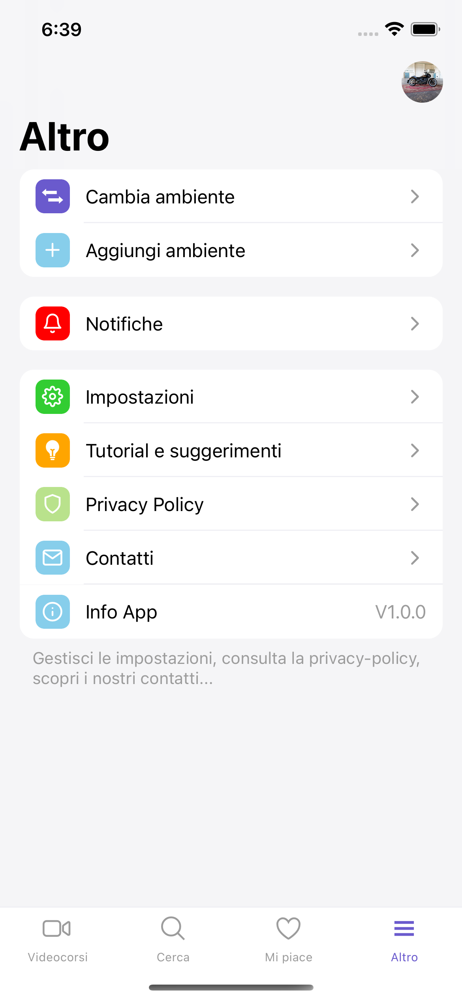

# 🇬🇧 Santo Riggio's Portfolio

## Personal Information

- **Profession**: React Native Junior Developer
- **Name**: Santo Riggio
- **Email**: info@santoriggio.it
- **Phone**: +39 3444298296

## Projects

### Ongoing Project: Customer360 App

The app I'm developing allows users to interact with the Framework360 platform. It will be a powerful tool that enables Framework360's customers to provide consumers with a customized app using various available templates, including video courses, e-commerce, restaurant apps, sales agents' apps, and more. It will include 4 images related to video courses to enhance the user experience.

  
  
  
  

### Applied Skills:

- React Native
- API Integration
- UI/UX Design and Development
- Code Management and Maintenance
- Local Database Management for Real-time Data Updates
- Push Notification Handling
- Deep-linking
- Storage with MMKV
- Utilizing the libraries [js-key-validator](https://github.com/santoriggio/js-key-validator) and [js-fast-emitter](https://github.com/santoriggio/js-fast-emitter), both created by me and available on GitHub.

### Other Projects I've Developed Include:

1. **Mobile Application for Framework360:**
   - A comprehensive app with numerous complex lists.
   - Integrated chat system.
   - Login and registration system for users and environments.
   - Push notification handling.
   - Deep-linking.
   - Usage of charts to monitor the environment for users.
   - Client details and order management.

2. **Client Projects:**
   - E-commerce App for online product sales.
   - Sales Agent App to facilitate order management.
   - Affiliation Card App with membership functionality.
   - Delivery App for home delivery service.
   - Restaurant App for online reservation and ordering.
   - Advertising App with Geofencing to promote local businesses.
