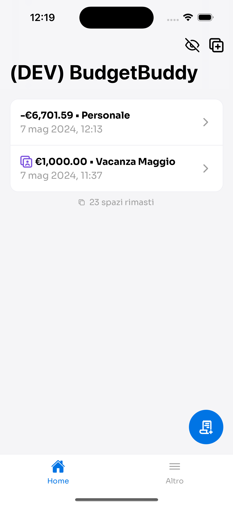
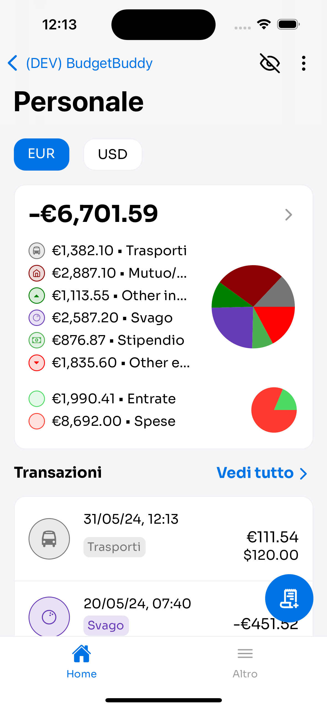
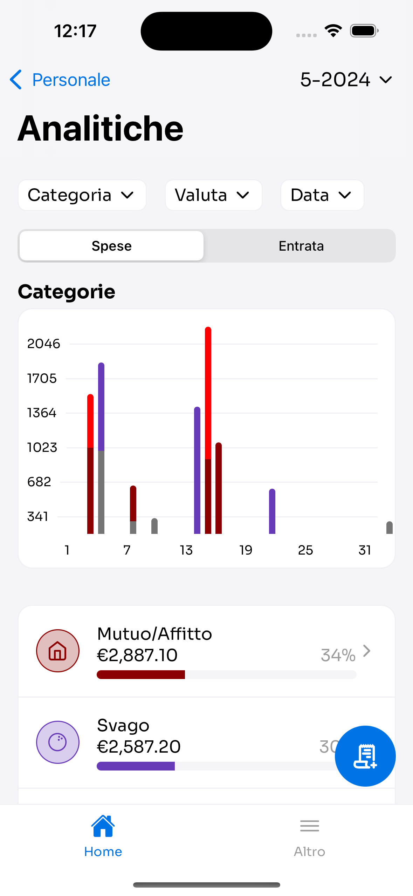
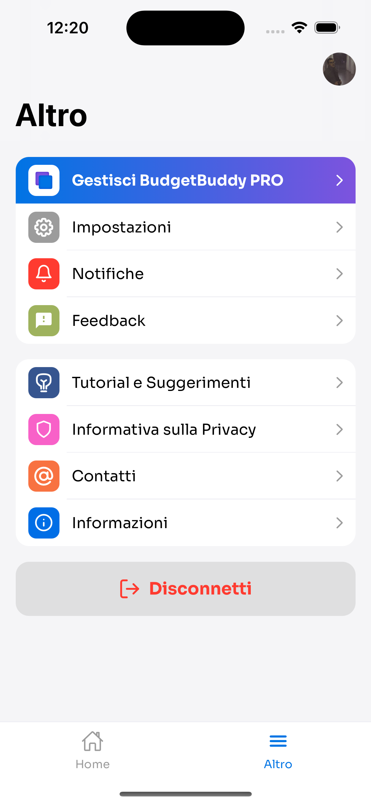

# 🇮🇹 Portfolio di Santo Riggio

## Informazioni personali

- **Professione**: React Native Developer
- **Nome**: Santo Riggio
- **Email**: info@santoriggio.it
- **Telefono**: +39 3444298296

## Progetti

### Progetti in sviluppo: BudgetBuddy

BudgetBuddy è un'applicazione per la gestione delle finanze personali che offre una serie di funzionalità avanzate. Gli utenti possono creare "Spazi", ovvero raccolte di transazioni, ciascuna con il proprio resoconto, transazioni programmate, valute e report mensili dettagliati. Questi report sono filtrabili per utente, categoria, valuta e data, consentendo agli utenti di monitorare e analizzare le proprie finanze in modo completo e personalizzato.

BudgetBuddy offre anche funzionalità secondarie per migliorare l'esperienza dell'utente. La gestione delle notifiche garantisce che gli utenti rimangano sempre aggiornati sulle loro transazioni e sui prossimi pagamenti. La completa sincronizzazione tra dispositivi consente agli utenti di accedere alle proprie finanze da qualsiasi luogo e dispositivo. Inoltre, il login facilitato tramite account Google e Apple semplifica il processo di registrazione e accesso, garantendo una maggiore comodità e sicurezza per gli utenti.

BudgetBuddy offre anche agli utenti la possibilità di inviare feedback direttamente dall'applicazione. Questo consente agli utenti di fornire consigli, suggerimenti o segnalare eventuali problematiche in modo rapido e diretto, contribuendo così a migliorare continuamente l'esperienza dell'applicazione.

  
  
  
  

#### Competenze applicate:
 - Completo sviluppo in ReactNative
 - Interfacciamento con strumenti di Firebase
 - Pagamenti IAP con RevenueCat
 - Implementazione di login e registrazione con i social
 - Gestione di ambienti separati per sviluppo e produzione
 - Notifiche Push
 - Completo supporto per il multilingua
 - Aggiornamento in tempo reale dei dati

### Progetti in Sviluppo: App Customer360

L'app che sto sviluppando permette di interfacciarsi con la piattaforma di Framework360. Sarà uno strumento potente che consentirà ai clienti di Framework360 di fornire ai consumatori un'app personalizzata con diversi template disponibili, tra cui Videocorsi, e-commerce, app per ristoranti, app per agenti di commercio e altro ancora. A seguire ci sono 4 immagini del template "Videocorsi" attualmente in sviluppo.

  
  
  
  

#### Competenze applicate:

- React Native
- Interfacciamento con API
- Progettazione e sviluppo di interfacce utente
- Gestione e mantenimento del codice
- Gestione di un database locale per l'aggiornamento dei dati in tempo reale
- Gestione delle notifiche push
- Deep-linking
- Storage con MMKV
- Utilizzo delle librerie [js-key-validator](https://github.com/santoriggio/js-key-validator) e [js-fast-emitter](https://github.com/santoriggio/js-fast-emitter) entrambe create da me e disponibili su GigHub

### Altri progetti che ho sviluppato includono:

1. **Applicazione Mobile per Framework360:**
   - Un'app completa con numerose liste complesse.
   - Sistema di chat integrato.
   - Sistema di login e registrazione per utenti e ambienti.
   - Gestione notifiche push
   - Deep-linking
   - Utilizzo di grafici fare monitorare l'ambiente agli utenti.
   - Dettaglio clienti e gestione degli ordini.

2. **Progetti per Clienti:**
   - App E-commerce per la vendita online di prodotti.
   - App per Agenti di Commercio per facilitare la gestione degli ordini.
   - App per Affiliazione Card con funzionalità di membership.
   - App Delivery per il servizio di consegna a domicilio.
   - App per Ristoranti per la prenotazione e l'ordinazione online.
   - App per la Pubblicità con Geofencing per promuovere attività locali.

